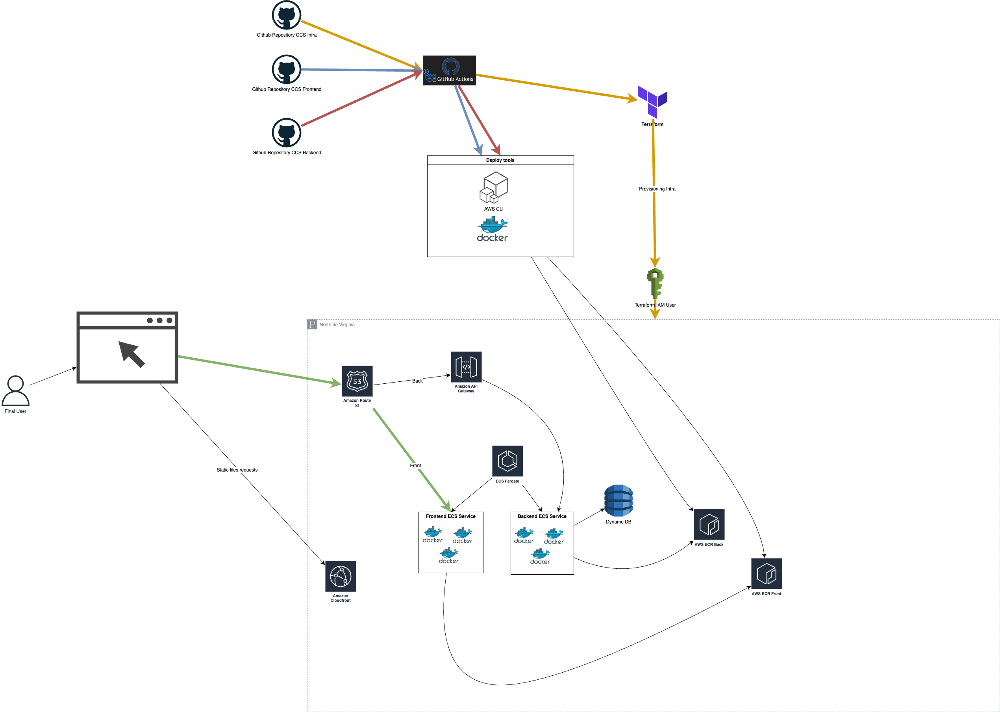

# Infraestructura AWS CCS

Este proyecto contiene la infraestructura necesaria para desplegar una aplicación con servicios de AWS utilizando Terraform. La infraestructura incluye los siguientes servicios:

- ECS Fargate con 2 servicios:
  - Backend
  - Frontend
- API Gateway para redireccionar hacia el servicio del backend
- Route 53 con subdominio:
  - frontend.example.com redirecciona al endpoint del servicio frontend
  - backend.example.com redirecciona al servicio backend ECS
- DynamoDB para almacenar datos
- IAM con dos usuarios:
  - Usuario Terraform para desplegar la infraestructura
  - Usuario Developer para desplegar las versiones de los aplicativos frontend y backend
- AWS CloudFront como CDN para el frontend
- AWS ECR con dos repositorios:
  - Repositorio para el frontend
  - Repositorio para el backend

